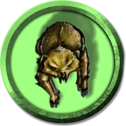

[Основные Токены](https://github.com/Kobold47/Dnd-Tokens-2/blob/main/images_mark/README.md) |
[Иконки](https://github.com/Kobold47/Dnd-Tokens-2/blob/main/images_icons/README.md) |
[Эффекты](https://github.com/Kobold47/Dnd-Tokens-2/blob/main/images_sfx/README.md) |
[Музыка](https://github.com/Kobold47/Dnd-Tokens-2/blob/main/music/) |
[Карты](https://github.com/Kobold47/Dnd-Tokens-2/blob/main/images_maps/README.md) |
[Арты](https://github.com/Kobold47/Dnd-Tokens-2/blob/main/images_arts/README.md) |
<table><tr>
<tr>
<td valign="bottom">
 
Альфон.png
</td>

<td valign="bottom">
 
Блуждающий огонёк.png
</td>

<td valign="bottom">
 
Бочка.png
</td>

<td valign="bottom">
 
Венцед.False.png
</td>

<td valign="bottom">
 
ВердаСкел.png
</td>

<td valign="bottom">
 
Вильям.png
</td>

</tr>
<tr>
<td valign="bottom">
 
Водалиций.png
</td>

<td valign="bottom">
 
Генрих.png
</td>

<td valign="bottom">
 
Дарк.png
</td>

<td valign="bottom">
 
Дракон.Зел.png
</td>

<td valign="bottom">
 
Жасмин.png
</td>

<td valign="bottom">
 
Зорбо.png
</td>

</tr>
<tr>
<td valign="bottom">
 
Мисая.png
</td>

<td valign="bottom">
 
монах.png
</td>

<td valign="bottom">
 
Н.а.к.р.png
</td>

<td valign="bottom">
 
Панцирница.png
</td>

<td valign="bottom">
 
плут.png
</td>

<td valign="bottom">
 
Поглотитель.png
</td>

</tr>
<tr>
<td valign="bottom">
 
Севен.png
</td>

<td valign="bottom">
 
Сорен.png
</td>

<td valign="bottom">
 
Тень.png
</td>

<td valign="bottom">
 
Фауналин.png
</td>

<td valign="bottom">
 
Флора.png
</td>

<td valign="bottom">
 
Хеки.png
</td>

</tr>
<tr>
<td valign="bottom">
 
Элис.png
</td>

</tr></table>